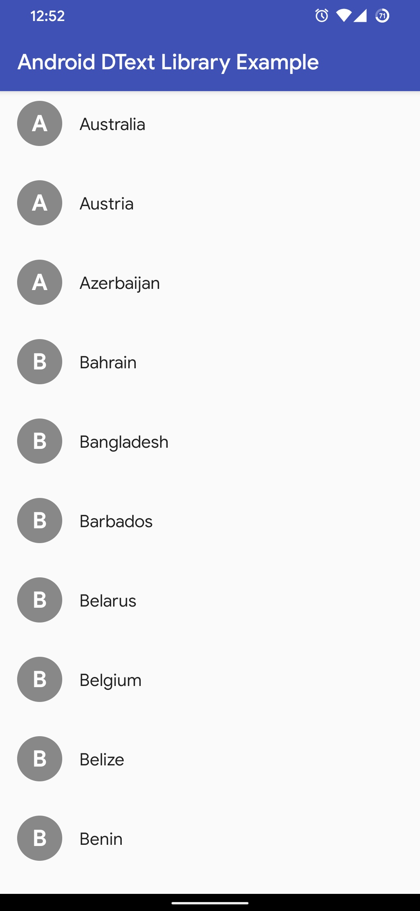
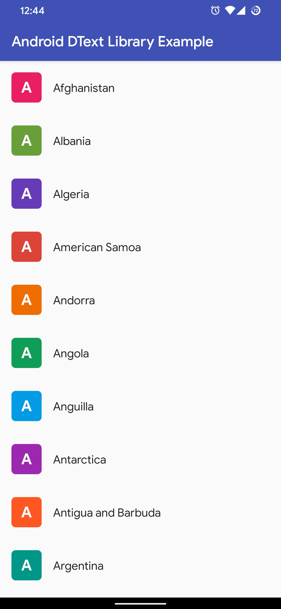
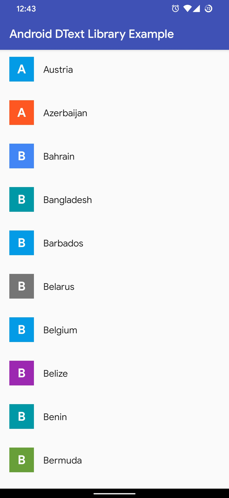

# Android DText Library

DText (For curious mind, it is DrawableText) is a minimal Android Library that creates beautiful drawable from a string. You can use it from anywhere from your project. By default it uses pixels as a unit of measurement. But you can use sp (for font specifics) or dp (for height/width specifics) by passing a 'context' to the builder.

## Table of Contents

[[_TOC_]]

## Screenshots

## Contributing

Pull requests are welcome. For major changes, please open an issue first to discuss what you would like to change.

Please make sure to update tests as appropriate.

## Thanks to

- Project Icon is made by [Freepik](https://www.flaticon.com/authors/freepik) from [www.flaticon.com](https://www.flaticon.com)

## License

[GNU General Public License v3.0](LICENSE)

Copyright © 2020 [Al Shakib](https://alshakib.dev)