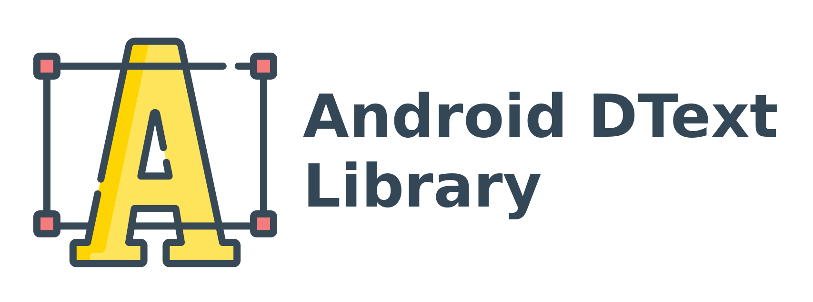

# Android DText Library

DText *(for curious mind, it is DrawableText)* is a minimal Android Library that creates beautiful [drawable](https://developer.android.com/reference/android/graphics/drawable/Drawable) from a string. You can use it from anywhere in your project. It is written in Java. The source code is published under GPLv3 and the license is available [here](LICENSE).

## Table of Contents

[[_TOC_]]

## Screenshots

## Supported SDK

The latest version is available for,

* Android SKD 14 and higer

## Contributing

Pull requests are welcome. For major changes, please open an issue first to discuss what you would like to change.

Please make sure to update tests as appropriate.

## Thanks to

- Project Icon is made by [Freepik](https://www.flaticon.com/authors/freepik) from [www.flaticon.com](https://www.flaticon.com)

## License

[GNU General Public License v3.0](LICENSE)

Copyright © 2020 [Al Shakib](https://alshakib.dev)