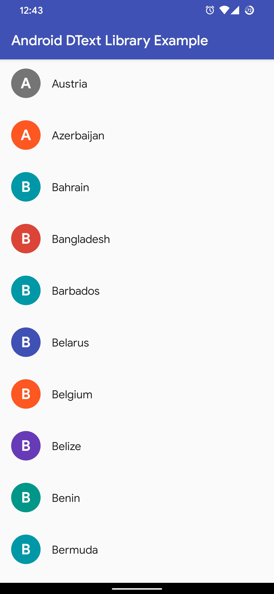

# Android DText Library

DText *(for curious mind, it is DrawableText)* is a minimal Android Library that creates beautiful [drawable](https://developer.android.com/reference/android/graphics/drawable/Drawable) from a string. You can use it from anywhere in your project. It is written in Java. The source code is published under GPLv3 and the license is available [here](LICENSE).

## Table of Contents

[[_TOC_]]

## Screenshots




## Supported SDK

The latest version is available for,

* Android SKD 14 and higher

## Getting Started

### Installation

***TODO***

### Basic Usages

For a simple drawable from a string,

```java
// Create a drawable with "Android" text
Drawable drawableText = new DText.Builder()
                .setText("Android")
                .build();
// Now you can use drawableText with an ImageView or any other components
```

### Customization

DText offers a variety of options that can be applied to individual requests, including shape, color, text options etc.

```java
// Create an instance of Builder class.
DText.Builder builder = new DText.Builder();

// Set text that we are going to draw.
builder.setText("Android DText Library");

// Draw only the first character.
// If the text is "android",
// then the builder will draw "a" on the canvas.
builder.firstCharOnly();

// Draw only the alphanumeric character.
// If the text is "<Unknown>",
// then the builder will draw first alphanumeric character
// from the text. In this case, it is "U".
// NOTE: alphaNumOnly() will not work without firstCharOnly().
builder.alphaNumOnly();

// Draw only the first digit from the text.
// If the text is "You have 5 notifications",
// then the builder will draw "5" on the canvas.
// NOTE: digitOnly() will not work without firstCharOnly().
builder.digitOnly();

// Use random background color from a nice preset background color list.
builder.randomBackgroundColor();

// You can pass your own color list to the builder as well.
List<String> colorList = new ArrayList<>();
colorList.add("#9C27B0");
colorList.add("#EF6C00");
builder.setRandomColorList(colorList);

// You can set a background color as well.
// By default, the background color is gray.
builder.setBackgroundColor(Color.BLUE);
// or
builder.setBackgroundColor("#0000FF");

// You can set text color with integer or string (HEX) value.
// By default, the text color is white.
builder.setTextColor(Color.RED);
// or
builder.setTextColor("#FF0000");

// Set height and width of the canvas.
builder.setHeight(150);
builder.setWidth(150);

// Set text size.
builder.setTextSize(24);

// Draw border around the canvas.
builder.setBorder(16);

// You can customize the border shade factor.
// By default DText uses 0.9f as a shade factor.
// 1f is 100% transparent, 0f is 100% solid!
builder.setBorderShadeFactor(0.7f);

// By default, DText uses pixels to calculate height, width and text size.
// But you can use DP for height/width and SP for text size as well
// by passing a context to the builder.
builder.useSpAndDp(context);

// Use bold text.
builder.boldText();

// Use italic text.
builder.italicText();

// Use bold italic text.
builder.boldItalicText();

// By default, DText uses Typeface.DEFAULT.
// But you can pass your own typeface as well.
builder.setTypeface(Typeface.create(Typeface.MONOSPACE, Typeface.NORMAL));

// Transform to upper case letter.
builder.toUpperCase();

// Draw as a round on the canvas.
builder.drawAsRound();

// Draw as a rectangle on the canvas.
builder.drawAsRectangle();

// Draw as a rectangle with border radius on the canvas.
builder.drawAsRectangle(16);
```

## Contributing

Pull requests are welcome. For major changes, please open an issue first to discuss what you would like to change.

Please make sure to update tests as appropriate.

## Thanks to

- Project Icon is made by [Freepik](https://www.flaticon.com/authors/freepik) from [www.flaticon.com](https://www.flaticon.com)

## License

[GNU General Public License v3.0](LICENSE)

Copyright © 2020 [Al Shakib](https://alshakib.dev)